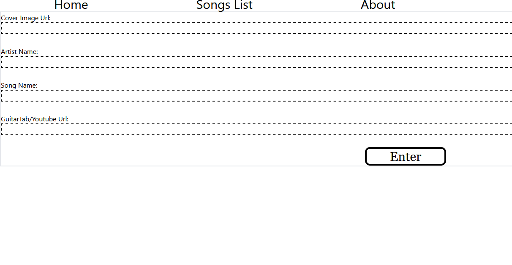

# SongList
Song list allows you to input and save songs, then view your saved songs and quickly navigate to a youtube video or guitar tab.
----------
This app was made using Create-React-App, ReactRouterV6, Json-Server, and TailwindCSS
# Usage
To use this app clone the repo, run npm install, and run json-server --watch db.json --port 3001.
# Examples

